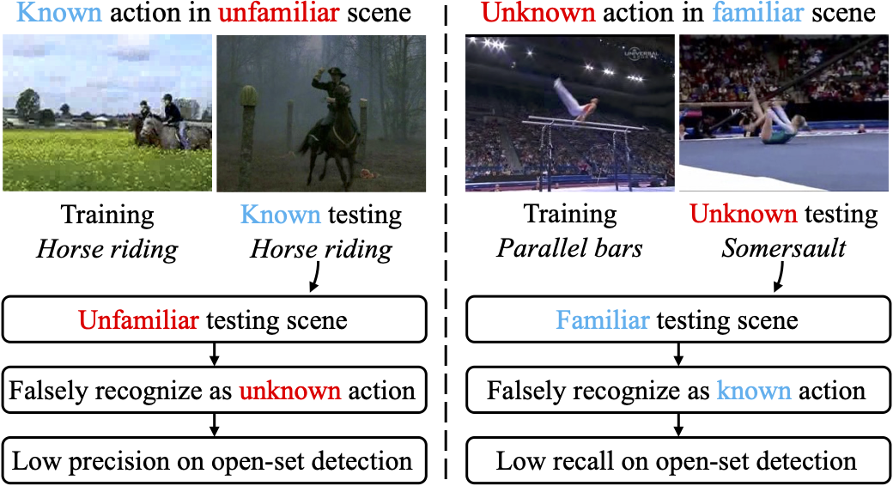

# SOAR: Scene-debiasing Open-set Action Recognition



This repo contains the original PyTorch implementation of our paper:

> [**SOAR: Scene-debiasing Open-set Action Recognition**](https://arxiv.org/abs/2309.01265)
>
> [Yuanhao Zhai](https://www.yhzhai.com), [Ziyi Liu](https://scholar.google.com/citations?user=m2k89xgAAAAJ), [Zhenyu Wu](https://wuzhenyusjtu.github.io), [Yi Wu](https://scholar.google.com/citations?user=s_8zWpgAAAAJ), [Chunluan Zhou](https://www.sites.google.com/view/chunluanzhou/), [David Doermann](https://cse.buffalo.edu/~doermann/), [Junsong Yuan](https://cse.buffalo.edu/~jsyuan/), and [Gang Hua](http://ganghua.org/)
>
> University at Buffalo, Wormpex AI Research
>
> ICCV 2023
>

## 1. Environment setup
Our project is developed upon MMAction2 v0.24.1, please follow [their instruction](https://github.com/open-mmlab/mmaction2/tree/v0.24.1) to setup the environemtn.

## 2. Dataset preparation
Follow these instructions to setup the datasets

- [UCF101](tools/data/ucf101/README.md)
- [HMDB51](tools/data/hmdb51/README.md)
- [MiTv2](tools/data/mit/README.md)

We provide pre-extracted scene feature and labels, and scene-distance-splitted subsets for the three datasets here (coming soon).
Please place them in the `data` folder.

## 3. Training
Upon the original MMAction2 train and evaluation scripts, we wrote a simple script that combines the training and evalution `tools/run.py`.

For training and evaluating the whole SOAR model (require the pre-extracted scene label):
```shell
python tools/run.py configs/recognition/i3d/i3d_r50_dense_32x2x1_50e_ucf101_rgb_weighted_ae_edl_dis.py --gpus 0,1,2,3
```

For the unsupervised version that does not require the scene label:
```shell
python tools/run.py configs/recognition/i3d/i3d_r50_dense_32x2x1_50e_ucf101_rgb_ae_edl.py --gpus 0,1,2,3
```


## 4. Evaluation

Coming soon


## Citation

If you find our work helpful, please considering citing our work.

```bibtex
@inproceedings{zhai2023soar,
  title={SOAR: Scene-debiasing Open-set Action Recognition},
  author={Zhai, Yuanhao and Liu, Ziyi and Wu, Zhenyu and Wu, Yi and Zhou, Chunluan and Doermann, David and Yuan, Junsong and Hua, Gang},
  booktitle={Proceedings of the IEEE/CVF International Conference on Computer Vision},
  pages={10244--10254},
  year={2023}
}
```

## TODO list
- [ ] Upload pre-extract scene feature and scene label
- [ ] Update scene-bias evaluation code and tutorial.


## Acknowledgement

This project is developed heavily upon [DEAR](https://github.com/Cogito2012/DEAR) and [MMAction2](https://github.com/open-mmlab/mmaction2). We thank [Wentao Bao](https://cogito2012.github.io/homepage/) [@Cogito2012](https://github.com/Cogito2012) for valuable discussion.